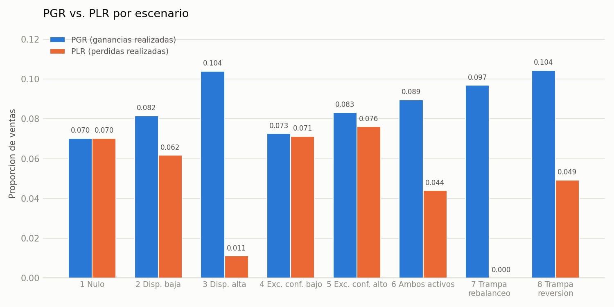
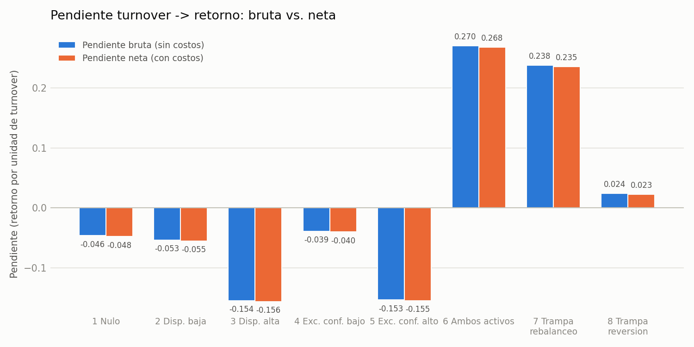
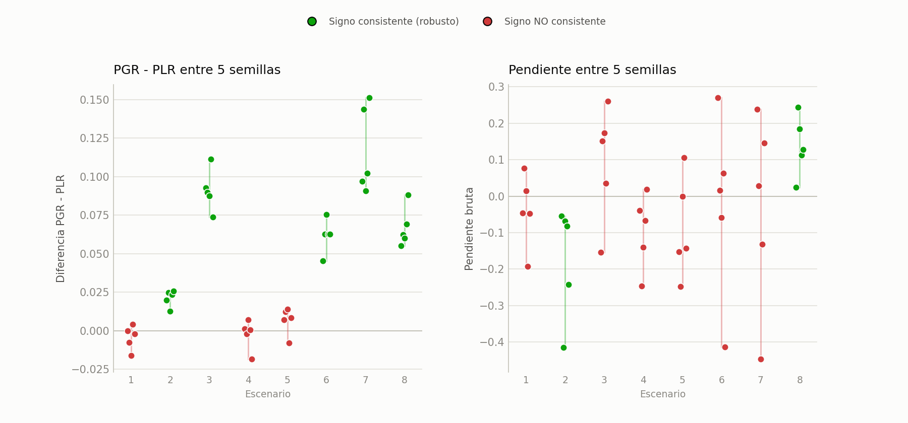

# Reporte de Simulación: Detección de Hábitos Financieros y Evaluación de Métodos de Medición

## ¿Qué buscamos con esta simulación?

El objetivo de este proyecto es poner a prueba las herramientas estadísticas que se usan en finanzas conductuales para detectar dos "malos hábitos" de los inversionistas, y averiguar qué tan confiables son esas herramientas cuando el contexto se complica:

1. **El Efecto Disposición (δ):** la tendencia psicológica a vender rápido las acciones que van ganando y "aguantar" las que van perdiendo, por no querer asumir la pérdida.
2. **El Exceso de Confianza (κ):** creer que se le puede "ganar al mercado", lo que lleva a operar (comprar y vender) con más frecuencia de la necesaria.

Para medir estos dos hábitos usamos dos herramientas estadísticas distintas: el indicador **PGR-PLR** (Odean, 1998) para detectar disposición, y una **regresión de retorno contra rotación de portafolio (turnover)** para detectar exceso de confianza. La pregunta central del proyecto no es solo "¿estas herramientas detectan el sesgo cuando existe?", sino también "¿se pueden equivocar, y qué tan seguido?". Para responder eso construimos 8 escenarios distintos y, al final, pusimos a prueba la confiabilidad de ambas herramientas repitiendo cada simulación con distintas semillas aleatorias.

---

## 1. ¿Cómo construimos el simulador?

Creamos un "mercado virtual" bajo reglas estrictas para que los resultados sean naturales y no estén manipulados de antemano.

- **Inversionistas virtuales:** 1,000 inversionistas, cada uno con entre $10,000 y $500,000 dólares para armar un portafolio de 5 a 30 acciones.
- **Un mercado justo:** simulamos 50 acciones durante 500 días. Regla de oro: las decisiones de los inversionistas *no* alteran los precios del mercado. Esto evita que el sistema "haga trampa" beneficiándose artificialmente de operar mucho.
- **Costos reales:** agregamos comisión y *spread* (diferencia entre precio de compra y de venta) en cada operación. Sin esto sería imposible medir si el exceso de confianza realmente cuesta dinero.
- **Personalidades, no reglas rígidas:** a cada trader le asignamos un nivel de δ (disposición) y un nivel de κ (exceso de confianza). Con esa personalidad, el sistema calcula día a día qué tan probable es que venda cada una de sus posiciones, y la decisión de vender es el resultado de esa probabilidad, no una regla fija.

---

## 2. Las dos métricas: cómo se leen

Antes de ver la tabla de resultados, definimos las dos columnas que van a aparecer una y otra vez.

**PGR y PLR.** Por cada venta que un trader realiza, comparamos su portafolio ese mismo día: ¿qué fracción de sus posiciones ganadoras vendió (PGR), contra qué fracción de sus posiciones perdedoras vendió (PLR)? Si **PGR es mayor que PLR**, el trader está vendiendo proporcionalmente más ganadoras que perdedoras — la firma clásica del efecto disposición. Si son iguales, no hay sesgo.

**La pendiente (turnover → retorno).** Aquí corremos una regresión: `retorno = intercepto + pendiente × turnover`, donde turnover es qué fracción de las posiciones de un trader se cerraron durante la simulación. La pendiente responde: "por cada unidad que sube el turnover de un trader, ¿cuánto cambia en promedio su retorno?". La corremos dos veces — contra el retorno **bruto** (sin costos) y contra el retorno **neto** (con comisión) — porque comparar ambas pendientes es el diagnóstico real de exceso de confianza: si ya es negativa en bruto, el problema no son los costos; si además es más negativa en neto, esa diferencia extra sí es el costo de operar.

---

## 3. Resultados generales

### 3.1 Disposición (PGR - PLR)

| ID | Escenario | PGR | PLR | Diferencia (PGR−PLR) | Rango esperado (9 de cada 10 simulaciones) |
| :-- | :-- | --: | --: | --: | :-- |
| 1 | Nulo (sin sesgos) | 0.0702 | 0.0702 | **0.0000** | [-0.0019, 0.0022] |
| 2 | Disposición baja | 0.0815 | 0.0617 | **0.0198** | [ 0.0175, 0.0220] |
| 3 | Disposición alta | 0.1039 | 0.0111 | **0.0928** | [ 0.0909, 0.0948] |
| 4 | Exceso de confianza bajo | 0.0726 | 0.0713 | **0.0013** | [-0.0008, 0.0035] |
| 5 | Exceso de confianza alto | 0.0832 | 0.0761 | **0.0072** | [ 0.0051, 0.0092] |
| 6 | Ambos hábitos activos | 0.0895 | 0.0440 | **0.0455** | [ 0.0431, 0.0482] |
| 7 | Trampa 1: rebalanceo automático | 0.0969 | 0.0000 | **0.0969** | [ 0.0953, 0.0986] |
| 8 | Trampa 2: reversión a la media | 0.1044 | 0.0493 | **0.0552** | [ 0.0534, 0.0571] |

*(El rango de la última columna sale de re-muestrear 500 veces, por cuenta de usuario, los eventos de venta de cada escenario — no por transacción individual, para respetar que las operaciones de un mismo trader están correlacionadas entre sí.)*

### 3.2 Exceso de confianza (pendiente turnover → retorno)

| ID | Escenario | Pendiente bruta | Pendiente neta | Diferencia (costo puro de operar) |
| :-- | :-- | --: | --: | --: |
| 1 | Nulo | -0.0462 | -0.0477 | -0.0015 |
| 2 | Disposición baja | -0.0535 | -0.0550 | -0.0014 |
| 3 | Disposición alta | -0.1544 | -0.1560 | -0.0016 |
| 4 | Exceso de confianza bajo | -0.0388 | -0.0401 | -0.0014 |
| 5 | Exceso de confianza alto | -0.1534 | -0.1548 | -0.0014 |
| 6 | Ambos hábitos activos | 0.2703 | 0.2683 | -0.0020 |
| 7 | Trampa 1: rebalanceo automático | 0.2378 | 0.2355 | -0.0023 |
| 8 | Trampa 2: reversión a la media | 0.0244 | 0.0228 | -0.0016 |

---

## 4. Resultados escenario por escenario

**Escenario 1 — Nulo.** Se esperaba que, sin ningún sesgo activado, PGR y PLR salieran exactamente iguales. Así fue: diferencia de 0.0000. Este escenario es nuestro control: confirma que el estimador no inventa un sesgo donde no hay ninguno.

**Escenarios 2 y 3 — Disposición baja y alta.** Se esperaba que la brecha PGR-PLR creciera junto con δ. Así ocurrió: 0.0198 con δ moderado y 0.0928 con δ alto — casi cinco veces más grande. El sesgo de disposición se detecta correctamente, y su tamaño escala con qué tan fuerte es el sesgo real.

**Escenarios 4 y 5 — Exceso de confianza bajo y alto.** Aquí δ=0 (nadie tiene sesgo de disposición), así que se esperaba una diferencia PGR-PLR de 0, sin importar qué tan alto fuera κ. Efectivamente salió casi cero en ambos (0.0013 y 0.0072): κ acelera qué tan rápido se opera, pero no decide *cuál* posición se vende, así que no genera una falsa señal de disposición.

Sobre la pendiente en estos dos escenarios, al principio pensamos que la caída del retorno se debía a las comisiones (que "las comisiones se comieron las ganancias"). Al revisarlo con cuidado, esa explicación resultó incorrecta: la diferencia entre la pendiente bruta y la neta —que es lo único que refleja el costo real de operar— es mínima en los ocho escenarios (entre -0.0014 y -0.0023, prácticamente constante). El verdadero origen de la pendiente negativa ya está presente en el retorno **bruto**, antes de cobrar un solo peso de comisión: es un efecto de **tiempo de exposición al mercado**. Una posición que se cierra antes del día 500 se valúa al precio de ese día, mientras que una que sigue abierta se valúa hasta el final; como el mercado tiene una tendencia positiva promedio, cerrar antes generalmente implica capturar menos de esa tendencia. Retomamos este punto con más detalle en la sección 5, porque resultó ser menos confiable de lo que parece a primera vista.

**Escenario 6 — Ambos hábitos activos.** Con δ y κ variando juntos en todo su rango, se esperaba una brecha PGR-PLR intermedia entre la de disposición baja y alta (ya que en promedio δ aquí es más moderado que en el escenario 3). Así salió: 0.0455, efectivamente entre 0.0198 y 0.0928. En la pendiente, este es el primer escenario donde el signo se vuelve positivo (0.2703) en la corrida principal; en la sección 5 explicamos por qué no le damos demasiado peso a ese número específico.

**Escenario 7 — Trampa del rebalanceo automático.** Este escenario no tiene ningún sesgo psicológico (δ=κ=0 para todos): las ventas las dispara una regla mecánica de rebalanceo que vende una posición solo cuando su peso en el portafolio creció demasiado — lo cual, por construcción, únicamente le puede pasar a una posición ganadora. Se esperaba (y así se diseñó a propósito) que esta regla generara una brecha PGR-PLR falsa y grande. Y así fue: diferencia de 0.0969 con PLR exactamente en 0.0000 — nunca se vende una perdedora — la señal de "disposición" más fuerte de los 8 escenarios, más grande incluso que la del escenario 3 con δ genuinamente alto. Es la prueba más clara del proyecto de que el indicador PGR-PLR puede confundir una regla estructural con un sesgo psicológico.

**Escenario 8 — Trampa de la reversión a la media.** Tampoco hay sesgo psicológico aquí (δ=κ=0): el trader vende cada vez más rápido entre más ha subido una posición, porque cree (como estrategia, no por miedo) que "lo que subió mucho va a bajar". Se esperaba, otra vez a propósito, una brecha PGR-PLR positiva y notable sin que exista disposición real. Salió 0.0552 — más chica que la del escenario 7 porque aquí la regla es probabilística y gradual, no un corte duro por peso de portafolio.

---

## 5. ¿Qué tan confiables son estos resultados? (prueba de robustez)

Todos los números de las secciones 3 y 4 vienen de correr cada escenario **una sola vez**, con una semilla aleatoria fija. Antes de sacar conclusiones, quisimos confirmar que esos números no fueran una casualidad de esa corrida en particular. Para eso, repetimos las 8 simulaciones completas con 5 semillas distintas y revisamos si el signo del resultado se mantenía igual en las 5.

| Métrica | Escenarios donde el resultado se sostiene entre semillas | Escenarios donde NO se sostiene |
| :-- | :-- | :-- |
| PGR - PLR (disposición) | 2, 3, 6, 7, 8 (y 1, 4 se sostienen "en cero", como se esperaba) | 5 (zona gris: la brecha es real pero muy chica y no siempre positiva) |
| Pendiente turnover→retorno (exceso de confianza) | 2 y 8 únicamente | 1, 3, 4, 5, 6 y 7 |

El PGR-PLR resultó ser un estimador sólido: en 7 de los 8 escenarios el resultado se repite sin importar la semilla (el escenario 5 es la única zona gris genuina). La pendiente turnover-retorno, en cambio, solo se sostiene en 2 de los 8 escenarios — en los otros seis, el número reportado en la sección 3.2 (incluyendo los llamativos +0.27 del escenario 6 y +0.24 del escenario 7) cambia de tamaño e incluso de signo si se vuelve a correr la simulación con otra semilla.

**¿Por qué una métrica es tan robusta y la otra no?** El PGR-PLR compara cada venta contra las posiciones hermanas del mismo trader **el mismo día** — nunca depende de qué le pase al mercado después. La pendiente, en cambio, depende del retorno, y el retorno de una posición cerrada se calcula con el precio del día en que se vendió, mientras que el de una posición abierta se calcula con el precio del día 500 — dos días de valuación distintos. Esa diferencia queda a merced de un solo detalle: si el tramo final del camino de precios que le tocó a esa simulación fue alcista o bajista. Como solo simulamos un camino de mercado por corrida (no un promedio de muchos posibles), ese ruido termina siendo, en la mayoría de los escenarios, más grande que la señal de comportamiento que queríamos medir.

**Esto no invalida el proyecto — lo hace más honesto.** Nos dice exactamente dónde sí podemos confiar en los números (todo lo relacionado con PGR-PLR, y las dos pendientes que sí se sostuvieron) y dónde el resultado de una sola corrida no debe presentarse como un hallazgo definitivo (la mayoría de las pendientes).

---

## 6. Gráficas

Las dos gráficas de barras de la sección 3 ya están incluidas arriba. Además, esta es la gráfica de la prueba de robustez de la sección 5: cada punto es el resultado de una semilla distinta; el color indica si el signo se mantiene (verde) o no (rojo) entre las 5.

Se nota de inmediato el contraste: el panel izquierdo (PGR-PLR) es mayormente verde, el derecho (pendiente) es mayormente rojo — es la misma conclusión de la sección 5, ahora en una sola imagen.

---

## 7. Limitaciones del diseño

- Cada escenario se simuló con **un solo camino de mercado** por corrida (una sola semilla). Como se documenta en la sección 5, esto es suficiente para el PGR-PLR pero insuficiente para la pendiente turnover-retorno, que necesitaría promediarse sobre muchos caminos de mercado para ser un estimador confiable en la mayoría de los escenarios.
- El turnover se definió como fracción de posiciones cerradas (conteo), no como volumen en dólares, para evitar que el tamaño de una ganancia contaminara artificialmente la medición.
- El modelo de costos es una simplificación (comisión fija + spread constante); no captura comisiones escalonadas ni impacto de mercado por volumen.

---

## 8. Conclusiones

El PGR-PLR demostró ser un estimador robusto para detectar el efecto disposición: distingue correctamente entre presencia y ausencia del sesgo (escenarios 1 vs. 2-3), escala con la intensidad del sesgo, y se mantiene estable si se repite la simulación. Sin embargo, los escenarios 7 y 8 prueban que **una fórmula estadística solo ve el patrón de ventas, no la intención detrás de ellas**: una regla de rebalanceo mecánica o una estrategia de reversión a la media, sin ningún componente psicológico, producen una señal de "disposición" tan fuerte —o más fuerte— que la de un sesgo real.

La regresión de turnover contra retorno, en cambio, resultó ser una herramienta mucho menos confiable de lo que su construcción sugiere. Aunque en la corrida principal parece mostrar patrones claros e interesantes (incluyendo un cambio de signo entre los escenarios de sesgo único y los de sesgo combinado o confounds), la prueba de robustez mostró que la mayoría de esos patrones no sobreviven al cambiar la semilla aleatoria — son ruido del camino de precios de una sola simulación, no una relación estructural del modelo. Los únicos dos casos donde sí podemos afirmar con confianza que existe una relación turnover-retorno consistente son el escenario 2 (disposición baja, relación negativa) y el escenario 8 (reversión a la media, relación positiva).

En conjunto, el proyecto no solo prueba qué tan bien funcionan estas dos herramientas cuando el sesgo es real — también expone sus límites: el PGR-PLR es vulnerable a confundir reglas estructurales con psicología, y la pendiente turnover-retorno, tal como está construida aquí, es vulnerable al ruido de un solo escenario de mercado. Ambas lecciones son, en sí mismas, un resultado válido de la investigación.
